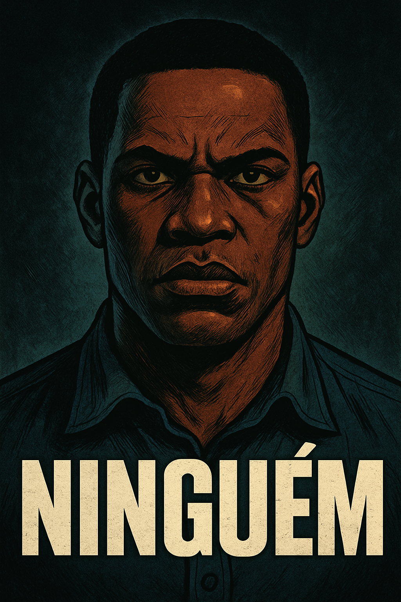

# HQ - "Ninguém" (Projeto de História em Quadrinhos)

## 👥 Equipe

**Nome do Grupo:** ADP Comics  
**Integrante:** Adriano de Paula

---

## 🎨 Tema da HQ

**Gênero:** Ação  
**Inspiração:** Filme *Anônimo (Nobody, 2021)*  
**Resumo:**  
A história acompanha um homem aparentemente comum, que vive uma rotina pacata com sua família. Após um assalto traumático, ele escolhe não reagir, despertando a crítica da comunidade. Porém, um evento violento traz à tona sua verdadeira identidade: um ex-agente de elite que tentou abandonar o passado sombrio. Ele volta à ação para proteger quem ama e redimir-se de antigos erros, desencadeando uma onda de confrontos intensos com o submundo do crime.

---

## 🎯 Objetivo

Criar uma história em quadrinhos com pelo menos 10 quadros, utilizando ferramentas de geração de imagem com IA, roteiro original e layout visual organizado, aplicando metodologias ágeis de desenvolvimento em grupo.

---

## 📁 Estrutura do Projeto

- Roteiro e storyboard
- Geração de imagens com IA
- Organização dos quadros e narrativa
- Layout final da HQ
- Publicação em formato acessível

---

## 🖼️ Preview

  

<em>Capa do HQ - "Ninguém"</em>

---

## 🔗 Links Importantes

- ✅ [Product Backlog (GitHub Issues)](https://github.com/adriano-de-paula/hq-anonimo/issues)
- ✅ [Kanban (GitHub Projects)](https://github.com/users/adriano-de-paula/projects/1) 

---

## ✅ Conclusão do Projeto

Todas as tarefas previstas no backlog foram concluídas. As sprints foram executadas utilizando a metodologia ágil com auxílio do GitHub Projects. A publicação final da HQ foi feita utilizando GitHub Pages.

---

## Veja o resultado final do HQ

- ✅ [Acesse a HQ online](https://adriano-de-paula.github.io/hq-anonimo/)
